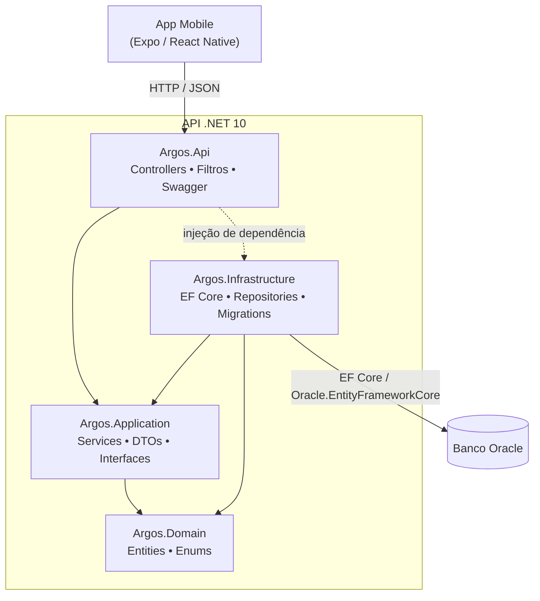
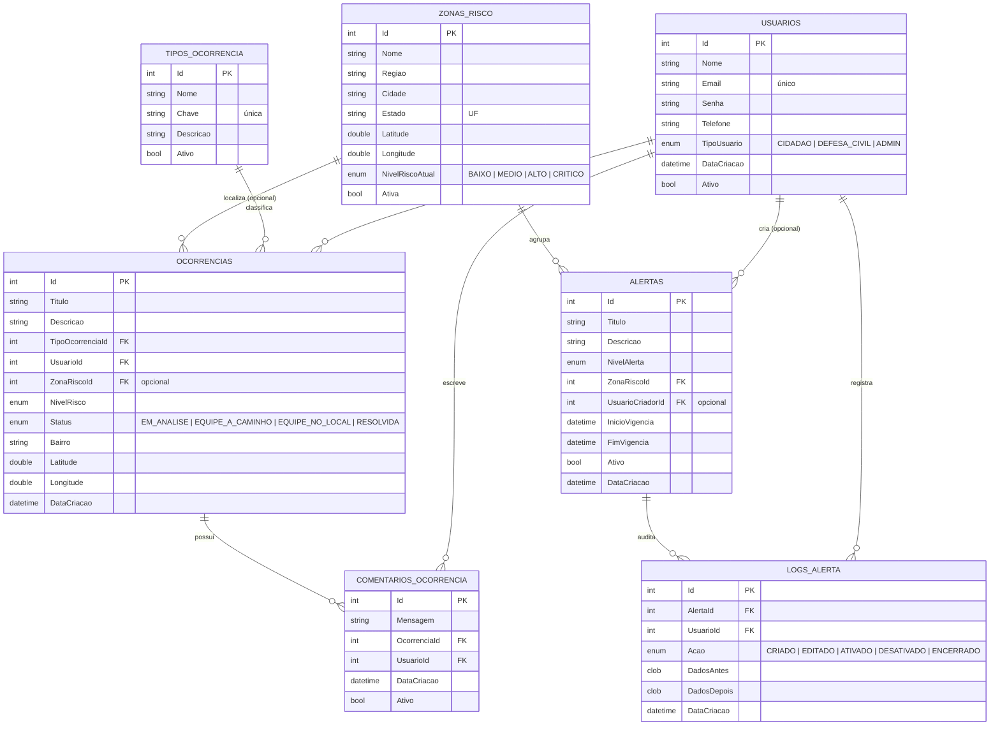

# Argos

## Descrição do Projeto

O **Argos** é uma plataforma de **monitoramento de ocorrências, alertas e zonas de risco** voltada à Defesa Civil e à população. Cidadãos reportam ocorrências (alagamentos, deslizamentos e outros incidentes) com localização e nível de risco, acompanham o andamento por meio de comentários, e recebem alertas oficiais emitidos pela Defesa Civil por zona de risco.

O sistema é composto por uma **API REST em .NET** (este repositório) consumida por um **aplicativo mobile (Expo / React Native)**. O backend centraliza ocorrências, alertas, zonas de risco e usuários, expondo um contrato simples e estável para o app.

O projeto foi desenvolvido como parte das entregas da FIAP, integrando conceitos de desenvolvimento back-end com boas práticas de arquitetura, persistência em banco de dados relacional e versionamento de schema via Migrations.

## Benefícios para o Negócio

- Centralização das ocorrências reportadas pela população em tempo quase real
- Canal oficial de alertas da Defesa Civil segmentado por zona de risco
- Acompanhamento do andamento de cada ocorrência (status e comentários)
- Histórico e auditoria das ações sobre alertas (quem criou, editou, ativou/desativou)
- Base geolocalizada para mapas e priorização de resposta
- Possibilidade de expansão futura para notificações push, dashboards e análise de dados

## Arquitetura da Solução

A solução adota **Clean Architecture** com quatro camadas e dependências apontando sempre para o domínio:



- **Argos.Domain** — entidades e enums, sem dependências externas. Regras de negócio e validações vivem aqui (construtores + métodos `UpdateXxx`).
- **Argos.Application** — DTOs, interfaces de repositório e serviços de aplicação (orquestração e regras de uso).
- **Argos.Infrastructure** — implementação do acesso a dados com EF Core (DbContext, configurações Fluent, repositórios) e as Migrations.
- **Argos.Api** — camada de entrada REST: controllers finos, tratamento global de erros (ProblemDetails / RFC 7807) e documentação Swagger.

Fluxo macro: **App Mobile → API Argos (REST/JSON) → EF Core → Banco Oracle**.

## Modelo de Dados (Diagrama ER)

O schema possui **relacionamentos 1:N** entre as entidades:



## Tecnologias Utilizadas

- C# / .NET 10
- ASP.NET Core (Web API)
- Entity Framework Core 9
- Oracle.EntityFrameworkCore (provider Oracle)
- Banco de Dados Oracle
- Swagger / Swashbuckle (OpenAPI)
- Git / GitHub

## Desenvolvimento

O backend segue **Clean Architecture** e algumas convenções importantes:

- **Domínio rico:** entidades com setters privados, validação no construtor e em métodos `UpdateXxx` (lançam `ArgumentException`), soft delete via `Ativar()` / `Desativar()`.
- **Persistência:** um `IEntityTypeConfiguration<T>` por entidade (descoberto automaticamente). Enums são gravados como **string** no banco; `bool` é mapeado para **`NUMBER(1)`** para compatibilidade com Oracle 19c/XE.
- **Migrations:** schema versionado com EF Core (`InitialCreate`), aplicado via `dotnet ef database update`.
- **API:** controllers finos, enums serializados como string em **MAIÚSCULAS** (ex.: `"ALTO"`, `"EM_ANALISE"`), e tratamento global de exceções convertendo erros em **ProblemDetails (RFC 7807)**.
- **Sem JWT no servidor:** a identidade do autor viaja como `usuarioId` no corpo das operações de escrita (decisão de projeto — o login é local no app).
- **Seed idempotente:** ao subir em ambiente de desenvolvimento, a API popula automaticamente dados de exemplo (tipos de ocorrência, usuários, zonas, ocorrências, comentários e alertas), sem duplicar em execuções repetidas.

### Estrutura de pastas

```
Argos/
├── Argos.Domain/          # Entidades e Enums (núcleo, sem dependências)
├── Argos.Application/      # DTOs, interfaces de repositório e serviços
├── Argos.Infrastructure/   # EF Core: DbContext, Configurations, Repositories, Migrations, Seeder
└── Argos.Api/              # Controllers, Extensions (DI), Exceptions (handler global), Program.cs
```

## Rotas da API

> Enums entram e saem como string em MAIÚSCULAS. Operações de escrita que precisam saber "quem fez" enviam `usuarioId` no corpo.

### Usuários (`/usuarios`)

| Método | Rota | Descrição |
|---|---|---|
| POST | `/usuarios` | Cadastra usuário (retorna o `id`) |
| GET | `/usuarios` | Lista todos os usuários |
| GET | `/usuarios/{id}` | Busca usuário por ID |
| PATCH | `/usuarios/{id}` | Atualização parcial |
| DELETE | `/usuarios/{id}` | Desativa (soft delete) |

### Tipos de Ocorrência (`/tipos-ocorrencia`)

| Método | Rota | Descrição |
|---|---|---|
| GET | `/tipos-ocorrencia` | Lista os tipos ativos |
| GET | `/tipos-ocorrencia/{id}` | Busca por ID |
| POST | `/tipos-ocorrencia` | Cria tipo |
| PATCH | `/tipos-ocorrencia/{id}` | Atualização parcial |
| DELETE | `/tipos-ocorrencia/{id}` | Desativa (soft delete) |

### Zonas de Risco (`/zonas-risco`)

| Método | Rota | Descrição |
|---|---|---|
| GET | `/zonas-risco` | Lista as zonas |
| GET | `/zonas-risco/{id}` | Busca por ID |
| POST | `/zonas-risco` | Cria zona |
| PATCH | `/zonas-risco/{id}` | Atualização parcial |
| DELETE | `/zonas-risco/{id}` | Desativa (soft delete) |

### Ocorrências (`/ocorrencias`)

| Método | Rota | Descrição |
|---|---|---|
| GET | `/ocorrencias?tipo={chave}&q={texto}` | Feed/busca (filtros opcionais) |
| GET | `/ocorrencias/{id}` | Busca por ID |
| POST | `/ocorrencias` | Registra ocorrência (autor no corpo) |
| PATCH | `/ocorrencias/{id}` | Muda status/nível/zona |
| DELETE | `/ocorrencias/{id}` | Remove (comentários em cascata) |

### Comentários (`/ocorrencias/{ocorrenciaId}/comentarios`)

| Método | Rota | Descrição |
|---|---|---|
| GET | `/ocorrencias/{ocorrenciaId}/comentarios` | Lista comentários da ocorrência |
| POST | `/ocorrencias/{ocorrenciaId}/comentarios` | Adiciona comentário (autor no corpo) |
| DELETE | `/ocorrencias/{ocorrenciaId}/comentarios/{id}` | Remove (soft delete) |

### Alertas (`/alertas`)

| Método | Rota | Descrição |
|---|---|---|
| GET | `/alertas?status={status}&nivel={nivel}` | Feed (filtros opcionais) |
| GET | `/alertas/{id}` | Busca por ID |
| POST | `/alertas` | Cria alerta (Defesa Civil) |
| PATCH | `/alertas/{id}` | Edita/ativa/desativa |
| DELETE | `/alertas/{id}` | Desativa (soft delete) |

## Como Executar o Projeto (How To)

### Pré-requisitos

Antes de iniciar, é necessário possuir:

- .NET SDK 10 instalado
- Acesso a um banco de dados Oracle (host, usuário e senha)
- Ferramenta `dotnet-ef` instalada (`dotnet tool install --global dotnet-ef`)
- Git instalado

---

### 1. Clonar o repositório

```bash
git clone https://github.com/Driven-Soft/ArgosApi-NET.git
```

---

### 2. Acessar a pasta do projeto

```bash
cd ArgosApi-NET
```

---

### 3. Configurar a connection string

No arquivo `Argos.Api/appsettings.Development.json`, informe as credenciais do seu Oracle em `ConnectionStrings:ArgosOracle`:

```json
{
  "ConnectionStrings": {
    "ArgosOracle": "Data Source=SEU_HOST:1521/SEU_SERVICO;User ID=SEU_USUARIO;Password=SUA_SENHA;"
  }
}
```

---

### 4. Restaurar dependências

```bash
dotnet restore
```

---

### 5. Aplicar as Migrations (criar o schema)

```bash
dotnet ef database update -p Argos.Infrastructure -s Argos.Api
```

Esse comando cria todas as tabelas do Argos no banco configurado.

---

### 6. Executar a aplicação

```bash
dotnet run --project Argos.Api
```

Em ambiente de desenvolvimento, a API popula automaticamente os **dados de exemplo (seed)** no primeiro start.

---

### 7. Testar os endpoints (Swagger pelo navegador)

Com a aplicação no ar, acesse a documentação interativa:

```
http://localhost:5084/swagger
```

E teste os endpoints (GET, POST, PATCH, DELETE).

## Testes

A API pode ser testada de três formas:

### 1. Swagger (interativo)

Acesse `http://localhost:5084/swagger` e execute as requisições direto pelo navegador. Todos os endpoints estão documentados com seus modelos de request/response.

### 2. Dados de seed (já populados em dev)

Ao subir em desenvolvimento, o banco já vem com dados de exemplo prontos para teste:

- 2 usuários (Defesa Civil e um cidadão), 3 tipos de ocorrência, 5 zonas de risco
- 4 ocorrências (com status variados), 3 comentários e 5 alertas

### 3. Exemplos com cURL

**Listar tipos de ocorrência:**
```bash
curl http://localhost:5084/tipos-ocorrencia
```

**Cadastrar um usuário (retorna o `id`):**
```bash
curl -X POST http://localhost:5084/usuarios \
  -H "Content-Type: application/json" \
  -d '{"nome":"Maria Souza","email":"maria@email.com","senha":"123456","tipoUsuario":"CIDADAO"}'
```

**Registrar uma ocorrência (autor no corpo via `usuarioId`):**
```bash
curl -X POST http://localhost:5084/ocorrencias \
  -H "Content-Type: application/json" \
  -d '{"titulo":"Rua alagada","descricao":"Água acima do meio-fio","tipoOcorrenciaId":1,"usuarioId":2,"latitude":-23.55,"longitude":-46.63,"nivelRisco":"MEDIO","bairro":"Sé"}'
```

**Listar alertas ativos de nível alto:**
```bash
curl "http://localhost:5084/alertas?status=ativo&nivel=ALTO"
```

**Comentar em uma ocorrência:**
```bash
curl -X POST http://localhost:5084/ocorrencias/1/comentarios \
  -H "Content-Type: application/json" \
  -d '{"mensagem":"Equipe a caminho do local.","usuarioId":1}'
```

> Em caso de erro, a API retorna **ProblemDetails (RFC 7807)** com `title` e `detail` (este último apenas em ambiente de desenvolvimento).

## Equipe — Driven Soft

| Nome | RM |
|---|---|
| Felipe Bezerra Beatrici | RM 564723 |
| Max Hayashi Batista | RM 563717 |
| Henrique Cunha Torres | RM 565119 |

### Repositório no GitHub

- https://github.com/Driven-Soft/ArgosApi-NET

### Vídeo de demonstração da solução completa:

- https://youtu.be/kaNmxGSJEzg
